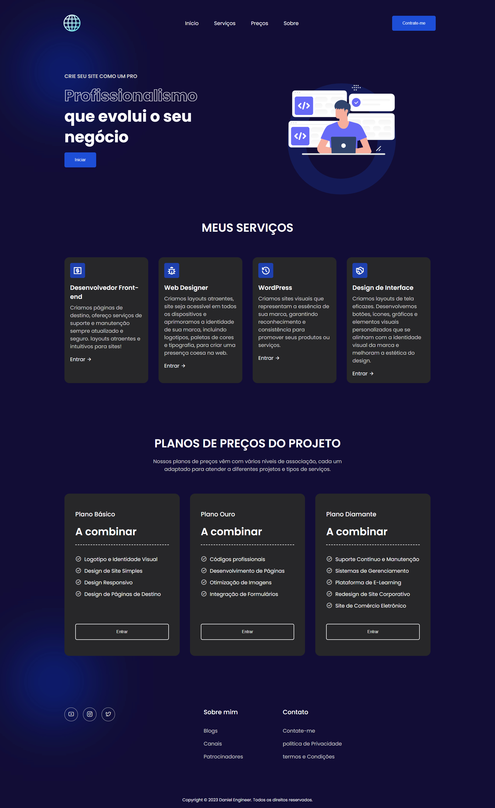

<b>Langing page profissional moderna</b>

&nbsp;
&nbsp;
&nbsp;

O projeto de site de landing page profissional tem como base fornecer informações profissionalizantes, áreas de preços, contatos, links e navegabilidade.

<a href="https://perfilweb.netlify.app/"><strong>Demonstração ao vivo</strong></a>

 

<b>Tecnologias Utilizadas:</b>

- Desenvolvido com HTML5 para estruturação.
- Estilo e design implementados com CSS3 para uma aparência moderna.
- Eventos e animações com JavaScript  

<b>Adaptabilidade para dispositivos:</b>

- Design responsivo garantindo uma experiência consistente em todos os dispositivos.
- Layout ajustável para telas de smartphones, tablets e computadores.
- Funcionalidades otimizadas para proporcionar navegação intuitiva em diferentes tamanhos de tela.  

<b>Recursos destacados:</b>

- Informações detalhadas sobre serviços pessoais e profissionais.  

<b>User Experience (UX):</b>

- Navegação intuitiva e amigável para proporcionar uma experiência positiva.
- Carregamento rápido e eficiente para garantir acessibilidade em diferentes condições de conexão.  

<b>Objetivo do projeto:</b>

- Facilitar o acesso a informações relevantes sobre os serviços profissionais.  

<b>Contato:</b>

Se você quiser entrar em contato comigo, sinta-se a vontade.
 

 
 

